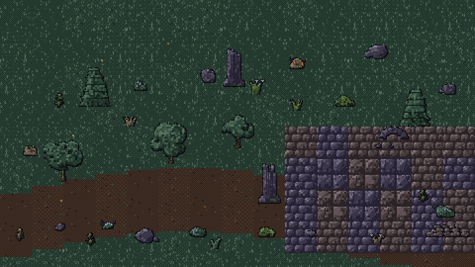
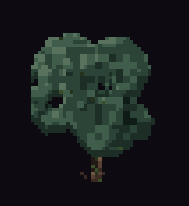
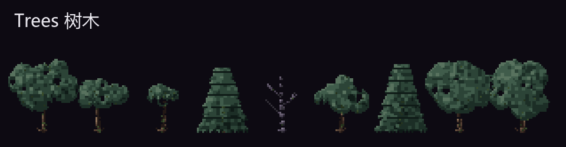
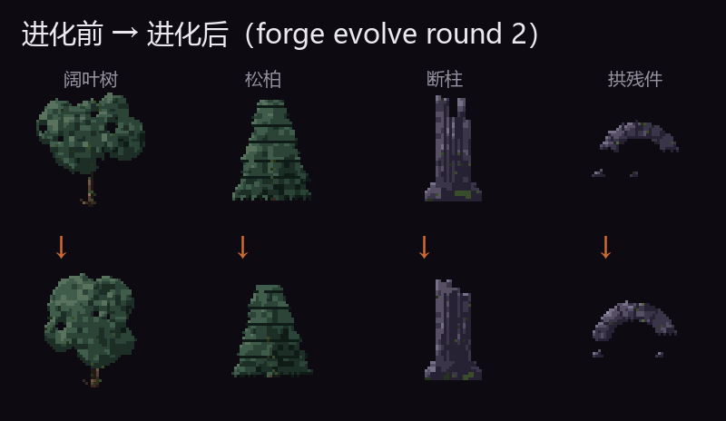

# aseprite-pixel-forge

[](https://github.com/ylty1516/aseprite-pixel-forge/actions/workflows/ci.yml)
[](LICENSE)
[](https://agentskills.io)

**让任何 AI agent 通过 Aseprite 无头 CLI 程序化创作游戏像素素材。**

Programmatic pixel-art studio for AI agents: drive [Aseprite](https://www.aseprite.org/) headlessly (batch + Lua 5.4) to generate game sprites, tiles and props — with style specs, a pixel-craft library, quantitative quality gates, and a generate → curate → evolve loop.



> 《神之左手》哥特暗黑风格 · 全部素材由本项目**程序化生成**（Godot 480×270 规格，2x 展示）。
> 植物动效为**配方原生多帧动画**（树冠相位摆动/团簇呼吸/叶片弯曲，`frames` 参数），经 Aseprite 导出；
> 漂浮火星与浆果脉动为场景演示点缀。

## 这是什么

不是"又一个素材生成器"，而是一条**可复现的质量流水线**（Agent Skills 标准技能包，pi / Claude Code / Codex 等 agent 装入 `~/.agents/skills/` 即可发现）：

- **style spec（风格规格）**：色板 ramp（暗→亮带色相偏移）、光照方向、轮廓策略、抖动密度——所有生成器服从同一份"美术圣经"，跨品类风格统一
- **技法库**：Lua 像素技法原语（光照明暗含 AO、选择性轮廓、Bayer 抖动、2×2 簇抖动、边界扰动、点缀、刻线、行级弯曲 shear），全部走注入种子 PRNG——**同 seed 逐字节可复现**
- **原生多帧动画**：树/灌木/花草支持 `frames` 参数输出多帧 `.aseprite`（每帧轮廓真实变化，非平移假动），可经 `export --gif` 直接产出循环 GIF
- **质量闭环**：批量生成候选 → 数值质检（色板违规/空图/触边）→ 放大 + 1x 联系表 → 视觉选优（rubric 五维打分）→ 参数进化（`forge evolve`）→ 图集/动图导出
- **全链路无头**：`aseprite -b --script`，不需要打开 GUI；任何能跑命令行的 agent 都能驱动

## 画廊

| 树木摆动（原生 6 帧动画，6x） | 变体矩阵（6 品类 × 全参数域） |
|---|---|
|  |  |

| 进化轮（父本 → 子代，参数扰动 + 重掷） |  |
|---|---|
|  |  |

完整产出与质量报告：**[examples/gothic-nature-pack](examples/gothic-nature-pack/)** —— 6 品类 / 52 张精灵 + 9 张图集，严格色板 100% 合规（含 `source_aseprite/` 源文件供人工精修）。

## 快速开始

**要求**：Aseprite 1.3+（[官网](https://www.aseprite.org/) / Steam 均可）· Python 3.10+（`pip install pillow`）· 无需其他依赖。

```bash
git clone https://github.com/ylty1516/aseprite-pixel-forge
cd aseprite-pixel-forge

# 0) 安装为全局 skill（供任何 agent 自动发现；也可跳过直接命令行用）
python scripts/forge.py install                # → ~/.agents/skills/aseprite-pixel-forge

# 1) 环境自检（定位 Aseprite + 端到端冒烟）
python scripts/forge.py doctor

# 2) 生成一轮候选（以树木为例：24 个变体）
python scripts/forge.py gen tree --style styles/left-hand-of-god.json \
    --count 24 --seed 1000 --out build/tree

# 3) 质检 + 预览（联系表 = 放大图 + 1x 并排 + 编号）
python scripts/forge.py check build/tree
python scripts/forge.py preview build/tree --scale 6 --cols 6

# 3b) 动画：树木 4 帧摆动版（frames 参数；export --gif 直接出循环 GIF）
python scripts/forge.py gen tree --style styles/left-hand-of-god.json \
    --count 8 --seed 2000 --param frames=4 --out build/tree-anim
python scripts/forge.py export build/tree-anim --out out/tree-anim --sheet --gif

# 4) 进化一轮（对保留编号做参数扰动）
python scripts/forge.py evolve build/tree --keep 1,5,9 --out build/tree-r2

# 5) 导出成品（自动裁剪透明边 + 图集 + 源文件 + 可复现清单）
python scripts/forge.py export build/tree-r2 --out out/tree --pick 1,3 --sheet
```

> Windows 上 `python` 可换 `py -3`。命令在仓库根目录执行；`--out` 建议指向你自己的项目目录。

## 内置配方（v1：自然物）

| 配方 | 内容 | 变体维度 |
|------|------|----------|
| `tree` | 阔叶树 / 枯树 / 松柏（支持摆动动画） | 高度 / 树冠占比 / 不对称 / 倾斜 / 苔藓量 / 帧数 |
| `bush` | 灌木（含浆果与微光点缀，团簇呼吸动画） | 大小 / 色板 / 枯枝 / 浆果 / 发光 / 帧数 |
| `rock` | 角面岩石 S/M/L | 尺寸 / 棱角 / 裂缝 / 副石 / 苔藓 / 冷暖石 |
| `flower` | 草簇 / 墓地百合 / 蕨类（叶片弯曲动画） | 形态 / 数量 / 高度 / 色板 / 发光 / 帧数 |
| `tile` | 草地 / 泥路 / 石板路 / 石地 32×32 | 类型 / 密度 / 苔藓 / 冷暖石 |
| `ruin` | 断柱 / 砖堆 / 拱残件 48×48 | 类型 / 破损度 / 苔藓 |

所有参数可用 `--param k=v` 定向固定；参数域列入配方声明，`evolve` 据此做范围内扰动。

## 工作流

```
style spec ──► gen N 候选 ──► check 数值剪枝 ──► preview 联系表
     ▲                                                │
     └── 新风格 = 新 JSON ◄── export 导出 ◄── evolve ◄─┘ 视觉选优（rubric 五维）
```

- **新游戏/新风格**：写一份 `styles/<项目>.json`（格式见 [references/style-spec.md](references/style-spec.md)），全流程原样复用
- **新品类**：按 [references/workflow.md](references/workflow.md) §6 写配方（`params` 声明 + `generate(ctx)` 实现），沉淀进 `lua/recipes/`
- 人物/建筑/动画在路线图 v2/v3；架构已预留人工精修（`source_aseprite/`）与图像模型补强接口

## 目录结构

```
├── SKILL.md                    # agent 入口（Agent Skills 标准）
├── scripts/                    # 引擎：forge CLI / Aseprite 执行器 / 风格系统 / 质检 / 导出
├── lua/
│   ├── lib/px.lua              # 技法库（形状/明暗/轮廓/抖动/簇/扰动，确定性）
│   ├── gen.lua                 # 生成入口（describe / generate 协议）
│   └── recipes/                # 配方：nature×6 + debug/smoke
├── styles/left-hand-of-god.json# 基准风格规格（哥特暗黑，13 色阶 × 5 阶）
├── references/                 # 方法论：技法规则 / 规格格式 / 评估 rubric / CLI 手册 / 工作流
├── tests/                      # 70 项测试（单测 + Lua 金样 + 集成 + 全变体矩阵 + 打包防护）
├── tools/make_showcase.py      # 演示素材构建（按 pack.json 参数重生成动画帧）
└── examples/gothic-nature-pack # v1 验收产出（含质量报告）
```

## 诚实的质量说明

- **已达**：自然物 6 类在哥特风格下达到"可直接进项目使用"（1x 可读、风格统一、色板严格 100%、批量确定性）
- **未达**（相比"商业成品级"的差距，记录在产出包里）：细节层次不如手绘、拱残件造型偏弱、动画覆盖品类有限（岩石/遗迹无动画，人物/建筑尚未开发——v2）、场景级艺术方向仍弱
- 与规格的已知偏差与缺口：见 [设计规格 §11](docs/superpowers/specs/2026-09-23-aseprite-pixel-forge-design.md)

## 测试

```bash
python -m pytest tests/ -q        # 有 Aseprite：70 项全跑；无 Aseprite：相关用例自动 skip
```

CI 在 Ubuntu + Python 3.12/3.13 上运行无 Aseprite 依赖的全部用例。

## 致谢与说明

- 由 [pi](https://github.com/badlogic/pi-mono) coding agent 在头脑风暴 → 规格 → 计划 → 实现 → 独立代码审查的完整流程中构建
- 像素画技法规则参考通用像素艺术实践（色板 ramp/色相偏移、簇纪律、选择性轮廓等）
- 许可证：MIT
